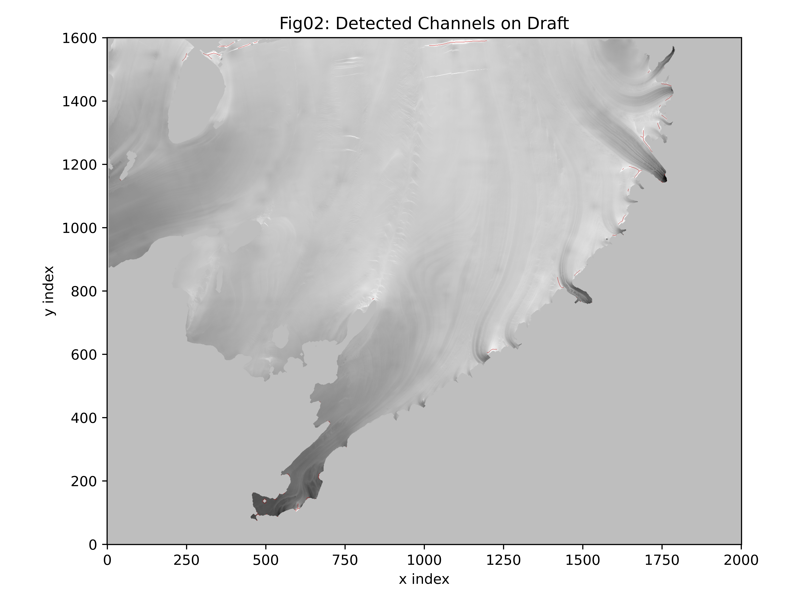

# Ice–Ocean Boundary Layer Pattern Explorer (IOBL-PX)

## Overview

IOBL-PX provides a reproducible BedMachine-based basal channel detection workflow with a command-line runner and an optional Streamlit interface, using the same underlying pipeline logic for both.

## Method Summary

1. Load the BedMachine Antarctica NetCDF dataset.
2. Subset a user-selected region of interest (ROI).
3. Build a floating-ice interior mask with an edge buffer.
4. Apply Gaussian filtering at large and small spatial scales.
5. Compute an anomaly field from the scale-separated draft signal.
6. Threshold the anomaly field using a high quantile.
7. Extract connected candidate channel structures and skeletonize centerlines.
8. Compute morphological diagnostics (length, orientation, and summary statistics).

## Data Source

BedMachine Antarctica is provided by NSIDC as dataset NSIDC-0756:
https://nsidc.org/data/data-access-tool/NSIDC-0756/versions/4

# file name that should be downloaded "NSIDC-0756_BedMachineAntarctica_19700101-20191001_V04.1.nc"

Place the dataset file at:
`data/raw/bedmachine_antarctica.nc`

Large external datasets are not tracked in git.

## Data Requirement

BedMachine data is not included in this repository. Place the NetCDF file at:

`data/raw/bedmachine_antarctica.nc`

If your downloaded file has a different name, rename it to `bedmachine_antarctica.nc`.

## Install

Base install:

```bash
pip install -e .
```

App extra:

```bash
pip install -e ".[app]"
```

Test extra:

```bash
pip install -e ".[test]"
```

## Requirements

- Python >= 3.10
- Tested with Python 3.14
- Key libraries: `numpy`, `scipy`, `xarray`, `scikit-image`, `matplotlib`
- Optional app dependency: `streamlit`

## CLI Quickstart

List and check ROI presets:

```bash
python scripts/run_detection.py --list-rois
python scripts/run_detection.py --check-rois
```

Run a standard ROI/tuning detection:

```bash
python scripts/run_detection.py --roi ross --tuning balanced
```

Run a sweep:

```bash
python scripts/run_detection.py --roi pine_island --sweep
```

## Outputs

Each run writes to a run-specific output directory under `outputs/` by default, including:

- `channels_mask.nc` and `skeleton.nc` (single-run mode)
- `diagnostics.json`
- `run_config.json`
- `figures/fig01_region_draft.png`
- `figures/fig02_channels_overlay.png`
- `figures/fig03_orientation_hist.png`
- `figures/fig04_channel_lengths.png`

Sweep mode additionally writes `sweep_results.csv` and sweep summary figures in `figures/`.

## Example Output



Generated run outputs are written to paths like:
`outputs/.../figures/fig02_channels_overlay.png`

## Typical Runtime

- Single ROI run: ~5–30 seconds
- Sweep mode: ~10–20 seconds depending on parameter grid

## Repository Structure

- `src/ioblp/` core pipeline logic
- `scripts/` CLI runner
- `app/` Streamlit interface
- `outputs/` generated results
- `data/raw/` BedMachine input dataset
- `tests/` optional test suite

## Streamlit (Local)

```bash
streamlit run app/streamlit_app.py
```

## Notes on Parameters

- `--tuning conservative` uses `threshold_quantile=0.99`, `sigma_small=4`, `min_length=30`.
- `--tuning balanced` uses `threshold_quantile=0.975`, `sigma_small=2`, `min_length=30`.
- `--tuning sensitive` uses `threshold_quantile=0.95`, `sigma_small=2`, `min_length=10`.
- Explicit CLI overrides (`--threshold-quantile`, `--sigma-small`, `--min-length`) take precedence over tuning defaults.
